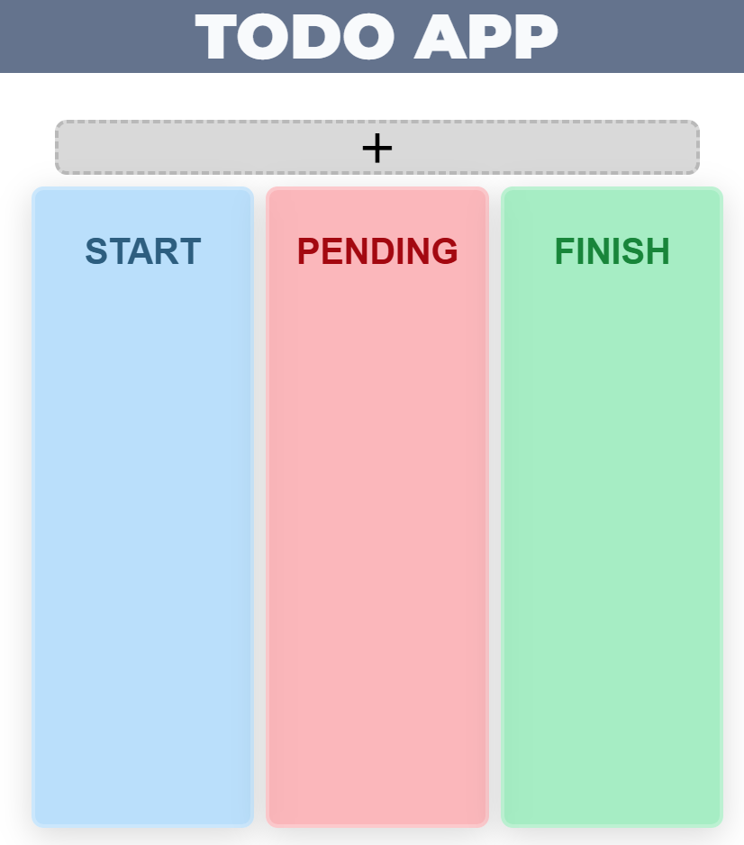
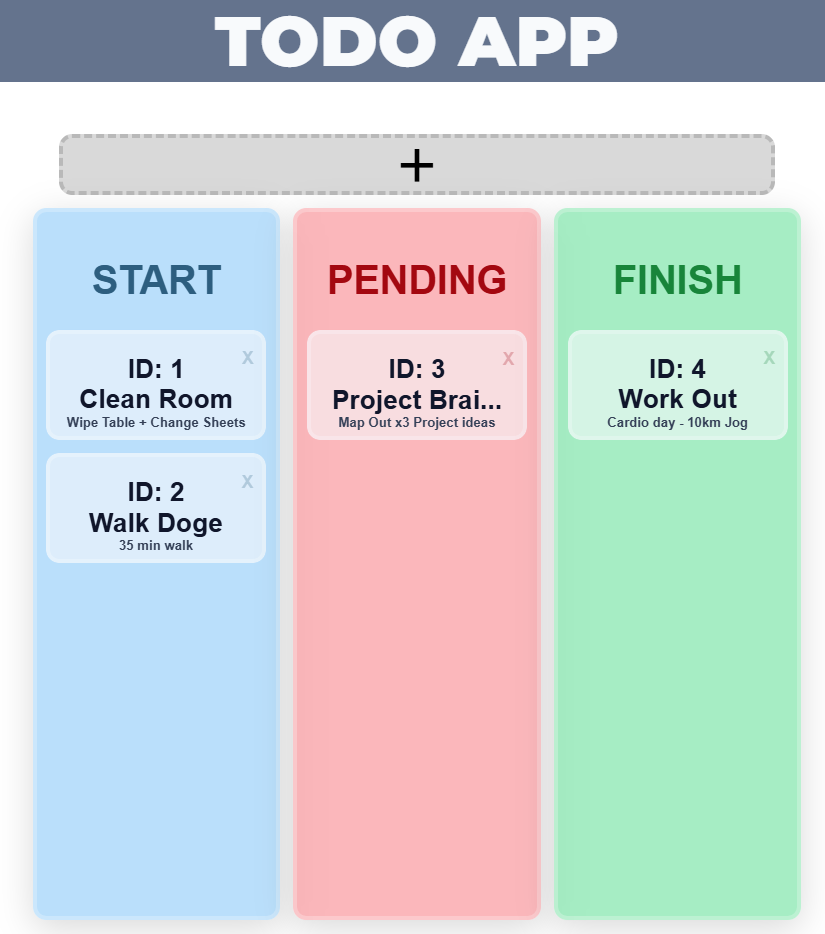
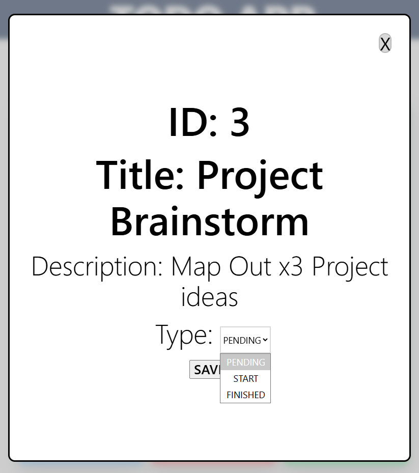

<!-- [Template Used](https://github.com/nology-tech/react-scss-template.git) -->

# Todo Full Stack App

[](https://github.com/pikmot/todoApp/actions/workflows/main.yml)

A fullstack todo application built with React and Spring Boot.

```
todoApp/
├── todoAppFrontEnd/ # React + TypeScript + Vite
│ └── src/
│ ├── components/ # UI components (Header, Modal, Task, Columns)
│ ├── pages/ # Home page
│ ├── services/ # API calls
│ └── scss/ # Shared styles, variables, mixins
│
├── todoAppBackEnd/demo/ # Spring Boot + Java 17
│ └── src/
│ ├── main/java/nology/io/todo/
│ │ ├── task/ # Entity, Controller, Service, Repository, DTOs
│ │ ├── config/ # CORS, ModelMapper, Data Seeder
│ │ └── common/ # Exception handler, error DTOs
│ └── test/ # Integration + unit tests
│
└── .github/workflows/ # CI pipeline
```

## Demo & Snippets

Home Screen | About Full

<div width="100%">




<div>

## Requirements / Purpose

### MVP

#### Front-End

- Display tasks in three columns (Start, Pending, Finished)
- Create new tasks via a button
- Edit task title, description, and status through a modal
- Delete tasks
- Responsive layout for mobile, tablet, and desktop

#### Back-End

- RESTful API with full CRUD endpoints for tasks
- Input validation on create and update requests
- Structured error handling with meaningful status codes
- Swagger/OpenAPI documentation

### Purpose of project

First Full Stack project using React & SpringBoot, focused on building a complete CRUD application with REST API, relational database and responsive frontend. Practiced Typescript, SCSS, Java Service/Controller architecture, plus writing Unity and Integration Testing for Back End.

### Tech Stack

- **Frontend:** React, TypeScript, Vite, SCSS
- **Backend:** Spring Boot, Java 17, Spring Data JPA, MySQL
- **Testing:** JUnit, RestAssured, Mockito, H2 (in-memory)

## Build Steps

### Backend

```bash
cd todoAppBackEnd/demo
./mvnw spring-boot:run
```

### SQL database

Requires -> localhost: 3306 + database named todo_task_database

```bash
#sample .env
DB_HOST=localhost
DB_PORT=3306
DB_USER=root
DB_NAME=todo_task_database
#windows/password if required
DB_PASSWORD=your_password
SPRING_PROFILE=dev
```

### Frontend

```bash
cd todoAppFrontEnd
npm install
npm run dev
```

### Swagger API

```bash
#can be accessed once Spring Boot server is running
http://localhost:8080/swagger-ui/index.html#/
```

## Design Goals / Approach

- **Three Columns for Start/Pending/Finished** - The inital project only had three columns as the priority was to get the back-end linked to the front end so additional columns were not a priority.
- **Dynamic Tasks Perssitence** - Tasks needed to be able to be edited via their Title, Description and Status fields this way it would replicated a Todo App and data needed to be handled via Back-End to allow persissten memory even after page refresh.
- **Glassmorphism Styling** - As part of every project I want to be improving stylistically for front-end designs so a focus front-end wise was to mess around with the colors, backdrop filter blurs and transparency to replicate and establish a style that seemed fitting.
- **Project Structure** - Due to it being my first Full Stack project, there was lots of refactoring required when it came to moving folder & files locations as i needed to make sure the overall infrastructure was readable, easy to navigate and followed recommened placements.
- **Error Handling/Testing** - The errors handled were the recommened ones plus additional edge cases were considered.

## Features

- Create, read, update, and delete tasks
- Move tasks between Start, Pending, and Finished columns via a dropdown
- Inline editing of task title and description in a modal
- Responsive design with breakpoints for mobile, tablet, laptop, and desktop
- Backend input validation with detailed error messages
- Swagger API documentation
- CI pipeline with GitHub Actions running backend tests on every push

## Known issues

- Additional Error handling and further testing for both front + back-end.
- Input Fields overflow and could be changed to text boxes.
- Editing Title or Description onClick is buggy and requires multipel clicks at times.
- Further Styling.
- Clicking delete on a task card also triggers the modal open (missing event propagation stop)

## Future Goals

- Better Styling
- Add Status as a column in Database so it can be dynamic
- Implement dark mode using Context
- Add user authentication via React Hook Form
- Add due dates and priority levels to tasks
- Drag and drop between columns

## Change logs

### 06/08/2026 - Initial UI Setup

- Set up project template with header component
- Built Start, Pending, and Finish column layout
- Completed base UI with styling, no dynamic functionality yet

### 11/08/2026 - Frontend Functionality

- Converted .jsx files to .tsx and fixed type errors
- Added editable task status, title, and description
- Added delete feature for tasks

### 13/08/2026 - Connecting Frontend & Backend

- Added frontend and backend to parent folder
- Wired up CRUD operations on the frontend
- Began linking frontend to backend API
- Added basic README

### 15/08/2026 - Full Stack CRUD Complete

- Connected frontend to backend with working create button
- Added delete with database integration
- Completed full CRUD across frontend and backend

### 16/08/2026 - Security & First Test

- Added .env for database credentials and created .env.example
- Wrote first backend integration test

### 17/08/2026 - Backend Testing

- Added controller tests for GET, POST, PATCH, and DELETE endpoints
- Added service layer unit tests with Mockito

### 18/08/2026 - CI, Responsiveness & Polish

- Added media queries for responsive design
- Fixed input overflow bug
- Set up GitHub Actions CI workflow for backend tests
- Added test reporter and workflow status badge to README

## What did you struggle with?

- Getting used to Typescript & .tsx having used Javascript prior & .jsx, so there was a learning curve when creating Types and Interfaces to impose on properties and Objects.
- Learning SpringBoot conventions and trying to understand the work flow from setting up a Controller and Service all the way to designing Tests and handling them globally.
- Testing and Mocking is still something that needs to be worked on as the terminology and methods to create a test still aren't familiar.

## Licensing Details

MIT License
